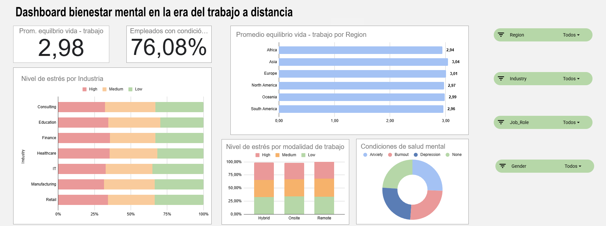

# Dashboard y Análisis en Google Sheets

## Objetivo del proyecto

Realizar un análisis exploratorio de un conjunto de datos de elección propia y elaborar un dashboard en Google Sheets, adjuntamos url de acceso a la hoja de cálculo donde podemos encontrar los datos cargados, su análisis y el Dashboard.

- https://docs.google.com/spreadsheets/d/1XjWav6Xs8AFvey4UyPdAU2Bva-L7Gld-HOEAwhgX7yA/edit?usp=sharing

## Origen de los datos

Hemos obtenido los datos des de https://www.kaggle.com/, en particular hemos elegido los datos sobre Remote Work & Mental Health:

- https://www.kaggle.com/datasets/iramshahzadi9/remote-work-and-mental-health

## Objetivo del conjunto de datos

Estos datos tratan de analizar el bienestar mental en la era del trabajo a distancia, es decir, como afecta el teletrabajo a los niveles de estrés, el equilibrio entre la vida laboral y personal (work-life balance) y las condiciones de salud mental (ansiedad, depresión, etc.) en diferentes industrias y regiones. 

### Columnas/Campos del conjunto de datos y tamaño

Nuestro conjunto de datos inicial está formado por 5000 filas y 20 columnas

A continuación vamos a describir que representan cada una de estas columnas:

- **Employee_ID**: Identificador único de cada empleado.
- **Age**: Edad del empleado.
- **Gender**: Género del empleado (puede ser masculino, femenenino, no binario, prefiere no decirlo).
- **Job_Role**: Rol actual del empleado.
- **Industry**: Industria en la que trabajan.
- **Years_of_Experience**: Años de experiencia del empleado en este rol. 
- **Work_Location**: Modalidad de trabajo (remoto, híbrido, presencial).
- **Hours_Worked_Per_Week**: Horas semanales trabajadas.
- **Number_of_Virtual_Meetings**: Número de reuniones online.
- **Work_Life_Balance_Rating**: Puntuación autoevaluada del equilibrio entre la vida personal y laboral (1 al 5).
- **Stress_Level**: Nivel de estrés autoevaluado por el empleado (bajo, medio, alto).
- **Mental_Health_Condition**: Condición de salud mental reportada (ansiedad, depresión, burnout, ninguna).
- **Access_to_Mental_Health_Resources**: Indica si el empleado tiene o no acceso a recursos de salud mental.
- **Productivity_Change**: Cambios en la productividad laboral (incrementa, disminuye, no cambia). 
- **Social_Isolation_Rating**: Puntuación autoevaluada (1 al 5) sobre qué tan aislado se siente el empleado.
- **Satisfaction_with_Remote_Work**: Nivel de satisfacción con las condiciones de trabajo remoto 
    (satisfecho, neutral,insatisfecho).
- **Company_Support_for_Remote_Work**: Puntuación autoevaluada (1 al 5) sobre la ayuda que recibe el empleado de su empresa para el facilitar el teletrabajo.
- **Physical_Activity**: Frecuenacia con que el empleado practica actividad física (semanal, diaria, ninguna).
- **Sleep_Quality**: Calidad del sueño (mala, buena, promedio)
- **Region**: Región a la que pertenece (Europa, África, Asia, Norteamérica, Sudamérica, Oceanía)

Clasificamos las diferentes columnas en alfanuméricas, numéricas, categóricas, categóricas ordinales y booleanas:

- **Alfanuméricas**: Employee_ID. (1)
- **Numéricas**: Age, Years_of_Experience, Hours_Worked_Per_Week, Number_of_Virtual_Meetings. (4)
- **Categóricas**: Gender, Job_Role, Industry, Work_Location, Stress_Level, Mental_Health_Condition, 
                   Productivity_Change, Satisfaction_With_Remote_Work, Physical_Activity, Sleep_Quality,
                   Region.(11)
- **Categóricas ordinales**: Work_Life_Balance_Rating, Social_Isolation_Rating, Company_Support_for_Remote_Work. (3)
- **Booleanas**: Access_to_Mental_Health_Resources.(1)

Hemos incluido como columnas categóricas ordinales aquellas que representan una autoevaluación realizada por el empleado donde la respuesta puede ser un valor entero del rango (1,5), es decir,  1-2-3-4-5 en el cual el valor 1 representa el valor más bajo y el 5 el más alto. 

## Análisis de los datos faltantes y nulos

Nuestro conjunto aparece limpio y transformado, a primera vista no vemos que haya datos faltantes y todos los datos parecen estar en el formato adecuado. 

Las únicas columnas que podrian contener nulos son:

- **Mental_Health_Condition**
- **Physical_Activity**

Realizando un análisis más exhautivo vemos que el dato "None" que aparece en ellas representaa que no tiene ninguna condición de salud mental reportada en la primera de ellas y que no realiza ninguna actividad física en la segunda, no que sean datos nulos o faltantes con lo que concluimos que no tenemos datos nulos en nuestro conjunto.

Utilizamos también las estadísticas de columna para comprovar que las columnas de nuestro conjunto no tienen celdas vacías.

## Dashboard

## 1. Introducción

En los últimos años, el teletrabajo se ha convertido en una modalidad laboral adoptada a nivel mundial. Si bien ha traído ventajas como mayor flexibilidad o reducción de desplazamientos, también ha generado interrogantes sobre su impacto en el bienestar mental de los empleados.

Este dashboard tiene como objetivo analizar el impacto del trabajo a distancia en el equilibrio entre la vida laboral y personal, los niveles de estrés y las condiciones de salud mental, como la ansiedad, el burnout o la depresión. El análisis se ha llevado a cabo a partir de un conjunto de datos previamente depurado y sin valores nulos, que abarca diversas regiones, industrias y modalidades de trabajo.

Aunque los datos presentan una distribución relativamente uniforme y parecen generados de forma sintética, el análisis permite identificar ciertos patrones y tendencias que pueden resultar relevantes. A pesar de estas limitaciones, se han extraído conclusiones significativas que ofrecen una visión general del bienestar mental en el contexto del trabajo remoto.

## 2. Descripción del Dashboard

El dashboard se estructura en los siguientes bloques visuales:

- **Indicadores clave (KPIs):**
  - **Promedio equilibrio vida-trabajo**: 2,98 (en una escala del 1 al 5).
  - **Empleados con alguna condición de salud mental reportada**: 76,08%.

- **Gráficos principales:**
  - **Promedio de equilibrio vida-trabajo por región**: revela ligeras variaciones entre continentes.
  - **Nivel de estrés por industria**: gráfico apilado que muestra la distribución de estrés (alto, medio y bajo) en cada sector.
  - **Nivel de estrés según modalidad de trabajo** (remoto, híbrido, presencial): comparativa entre los diferentes formatos.
  - **Condiciones de salud mental**: gráfico de anillo con distribución de ansiedad, burnout, depresión y personas sin ninguna condición diagnosticada.

- **Filtros interactivos:** permiten segmentar por región, industria, rol laboral y género para facilitar el análisis personalizado.

## 3. Análisis del Dashboard

- **Alta incidencia de condiciones de salud mental:** Más del 76% de los empleados reportan sufrir alguna condición (ansiedad, burnout o depresión).

- **Burnout como principal condición:** Es la más revalente en el gráfico circular, ya que la desconexión digital insuficiente y la sobrecarga en el teletrabajo se relacionda directamente con este síndrome.

- **Diferencias regionales leves:** Asia muestra el mejor promedio de equilibrio vida-trabajo (3,04), seguida por Europa (3,01). África presenta el promedio más bajo (2,94), aunque las diferencias son muy pequeñas.

- **Finanzas y Sanidad lideran la lista de las industrias con el mayor nivel de estrés:** Ambas destacan por tener la mayor proporción de empleados con niveles de estrés alto: Finanzas con un 35,6 % y Sanidad con un 35,3 %. Educación y Retail también presentan porcentajes elevados, cercanos al 34 %. Aunque las diferencias entre sectores no son muy marcadas, todas las industrias muestran niveles de estrés superiores al 31 %.

- **Modalidad Onsite ligeramente menos estresante:** El trabajo presencial presenta una proporción ligeramente superior de personas con estrés bajo y ligeremente inferior de personas con estrés alto en comparación con híbrido o remoto.

## 4. Conclusiones

A partir del análisis realizado en este dashboard, se pueden extraer varias observaciones sobre el impacto del trabajo a distancia en la salud mental de los trabajadores. No obstante, es importante subrayar que los datos utilizados presentan una distribución bastante uniforme entre categorías, y podrían haber sido generados de manera sintética o artificial. Esto limita la capacidad de generalizar los resultados a contextos reales. Además, hay que tener en cuenta que la muestra no es especialmente grande.

Lo más destacable del análisis es que, aunque el trabajo a distancia puede mejorar el equilibrio entre la vida personal y laboral en ciertos contextos, no está exento de riesgos para la salud mental. De hecho, más del 75 % de los empleados han reportado haber sufrido o estar pasando por alguna condición relacionada con la salud mental, siendo el burnout la más destacada.

Por otra parte, el estrés continúa siendo un factor significativo en todas las modalidades de trabajo y, aunque es necesario y habitual en la mayoría de las situaciones laborales, tanto los trabajadores como las empresas deberían apostar por reducirlo.

Por último, el conjunto de datos no aporta evidencias suficientes para destacar alguna región o industria sobre las demás, ya que todas presentan métricas similares.

## Próximos pasos
Sería interesante ampliar este estudio utilizando una muestra más grande y con datos reales, que reflejen mejor la diversidad de situaciones actuales. El conjunto de datos analiza una temática muy relevante que seguirá presente en los próximos años o incluso décadas. Cuanto antes aprendamos a encontrar un mejor equilibrio entre la vida personal y laboral en la era de la digitalización y el trabajo a distancia, más preparada y saludable será nuestra sociedad. 

## Autores

- Edgar Salom (https://github.com/EdgarrSalom)